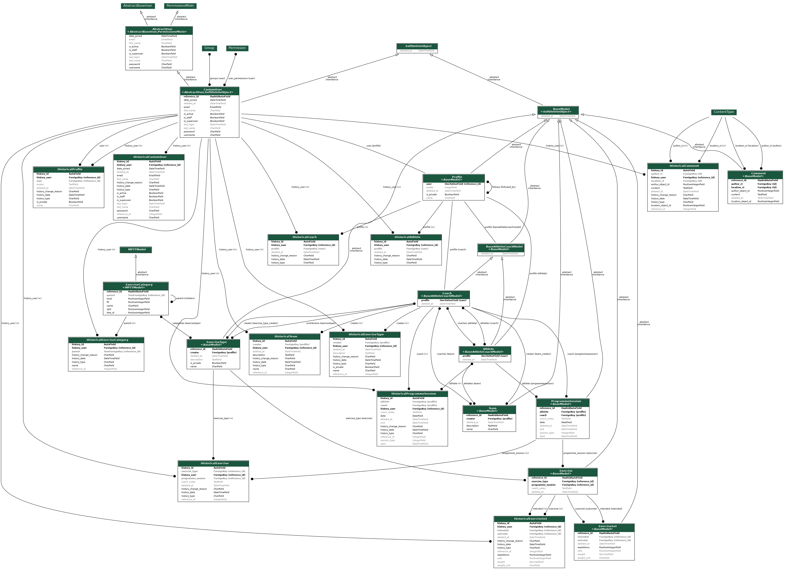

# Train With Someone

## About

My coach sends me a program via Google Sheets. It works, but let's see if I can make something better.

The idea is a coach can send a program to an athlete. The athlete can provide feedback to the coach.

## Models

## Credits

Built on twitch:

Thanks to:

- Vinitkme
- Mazzari
- _redacted_
- mrwoldfredstep
- Raticide
- Samwhoo
- Aroretini
- Handlefa1
- dyrenh
- peasantlike
- mrsimpson00
- TekiEd

(please let me know if you do not want to be on here)
